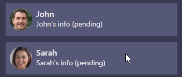
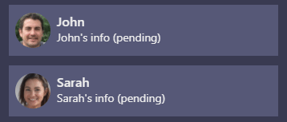
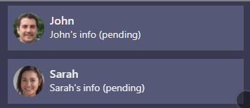
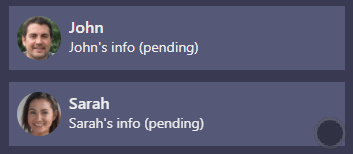

<h1 align="center">react-swipeable-list</h1>
<h4 align="center">A configurable react component to render list with swipeable items.</h4>
<p align="center">
  </img>
</p>

<p align="center">
  <a href="#demo">Demo</a> •
  <a href="#installation">Installation</a> •
  <a href="#usage">Usage</a>
</p>

<hr />

[](https://github.com/marekrozmus/react-swipeable-list/actions)
[](https://codecov.io/gh/marekrozmus/react-swipeable-list)


## React Swipeable List component

A react component to render list with swipeable items. Items can have one or more actions on left (leading) and right (trailing) swipe and different behaviour depending on props. [See examples](#type)

## Demo

Check [working example page](https://marekrozmus.github.io/react-swipeable-list/)

[](https://codesandbox.io/s/github/marekrozmus/react-swipeable-list/tree/main/examples)

## Installation

```bash
npm install react-swipeable-list
# or via yarn
yarn add react-swipeable-list
```

## Usage

```jsx
import {
  LeadingActions,
  SwipeableList,
  SwipeableListItem,
  SwipeAction,
  TrailingActions,
} from 'react-swipeable-list';
import 'react-swipeable-list/dist/styles.css';

const leadingActions = () => (
  <LeadingActions>
    <SwipeAction onClick={() => console.info('swipe action triggered')}>
      Action name
    </SwipeAction>
  </LeadingActions>
);

const trailingActions = () => (
  <TrailingActions>
    <SwipeAction
      destructive={true}
      onClick={() => console.info('swipe action triggered')}
    >
      Delete
    </SwipeAction>
  </TrailingActions>
);

<SwipeableList>
  <SwipeableListItem
    leadingActions={leadingActions()}
    trailingActions={trailingActions()}
  >
    Item content
  </SwipeableListItem>
</SwipeableList>;
```

## SwipeableList Props

### fullSwipe

Type: `boolean` (optional, default: `false`)

Changes behaviour of `IOS` list type.
When `true` and swipe is done beyond `threshold` and released the action is triggered.

</img>

When set to `false` actions are only opened and they need to be clicked to trigger action.

</img>

### destructiveCallbackDelay

Type: `miliseconds` (optional, default: `1000`)

Time in miliseconds after which swipe action should be called for `destructive` swipe action (item deletion)

### style

Type: `object` (optional, deafult: `undefined`)

Additional styles for list tag.

### type

Type: `ListType (ANDROID | IOS | MS)` (optional, deafult: `ANDROID`)

Changes behavior of swipeable items.

#### `ANDROID`

</img>

#### `IOS`

</img>

#### `MS`

</img>

### Tag

Type: `string` (optional, deafult: `div`)

HTML tag that is used to create this component.

### scrollStartThreshold

Type: `number` (optional, default: `10`)

How far in pixels scroll needs to be done to block swiping. After scrolling is started and goes beyond the threshold, swiping is blocked.

It can be set for the whole list or for every item. See `scrollStartThreshold` for `SwipeableListItem`. Value from the `SwipeableListItem` takes precedence.

### swipeStartThreshold

Type: `number` (optional, default: `10`)

How far in pixels swipe needs to be done to start swiping on list item. After a swipe is started and goes beyond the threshold, scrolling is blocked.

It can be set for the whole list or for every item. See `swipeStartThreshold` for `SwipeableListItem`. Value from the `SwipeableListItem` takes precedence.

### threshold

Type: `number` (optional, default: `0.5`)

How far swipe needs to be done to trigger attached action. `0.5` means that item needs to be swiped to half of its width, `0.25` - one-quarter of width.

It can be set for the whole list or for every item. See `threshold` for `SwipeableListItem`. Value from the `SwipeableListItem` takes precedence.

## SwipeableListItem Props

### blockSwipe

Type: `boolean` (optional, default: `false`)

If set to `true` all defined swipe actions are blocked.

### onSwipeStart

Type: `() => void`

Fired after swipe has started (after drag gesture passes the `swipeStartThreshold` distance in pixels).

### onSwipeEnd

Type: `() => void`

Fired after swipe has ended.

### onSwipeProgress

Type: `(progress: number) => void`

Fired every time swipe progress changes. The reported `progress` value is always an integer in range 0 to 100 inclusive.

### scrollStartThreshold

Type: `number` (default: `10`)

How far in pixels scroll needs to be done to block swiping. After scrolling is started and goes beyond the threshold, swiping is blocked.

It can be set for the whole list or for every item. See `scrollStartThreshold` for `SwipeableList`. Value from the `SwipeableListItem` takes precedence.

### swipeStartThreshold

Type: `number` (default: `10`)

How far in pixels swipe needs to be done to start swiping on list item. After a swipe is started and goes beyond the threshold, scrolling is blocked.

It can be set for the whole list or for every item. See `swipeStartThreshold` for `SwipeableList`. Value from the `SwipeableListItem` takes precedence.

### threshold

Type: `number` (default: `0.5`)

How far swipe needs to be done to trigger action. `0.5` means that item needs to be swiped to half of its width, `0.25` - one-quarter of width.

It can be set for the whole list or for every item. See `threshold` for `SwipeableList`. Value from the `SwipeableListItem` takes precedence.

## SwipeAction Props

### destructive

Type: `boolean` (optional, default: `false`)

If set to `true` then remove animation is played and callback is called after `destructiveCallbackDelay`.

### onClick

Type: `function` (required)

Callback function that should be call after swipe action is triggered.

### Tag

Type: `string` (optional, deafult: `span`)

HTML tag that is used to create this component.
